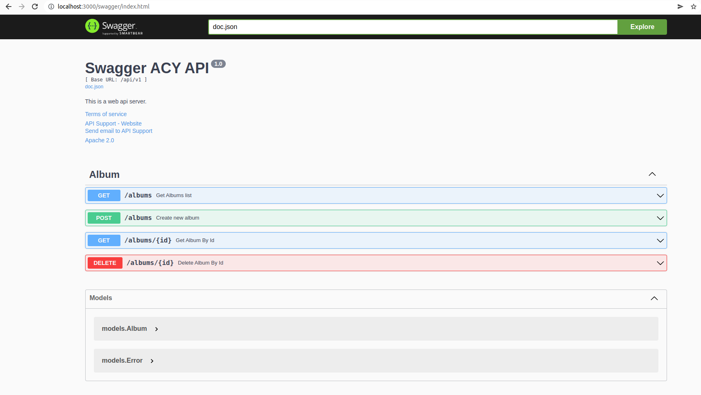

#### 1. init go module

```
go mod init module acy.com/api
```

#### 2. install

```
go get -u github.com/gin-gonic/gin
```

#### 3. Init server file

src/server.go

```go
package main

import (
	"github.com/gin-gonic/gin"
)

func main() {
	r := gin.Default() // setup default router with some common middleware

	r.GET("/", func(c *gin.Context) {
		c.String(http.StatusOK, "Hello world!")
	})

    r.Run(":3000")
}
```

#### 4. Create a bash file for start debugging

```sh
#!/bin/bash

go build src/server.go

# export GIN_MODE=release
export GIN_MODE=debug

./server
```

#### 5. Add Router group

server.go

```go
package main

import (
	"net/http"

	"acy.com/api/src/controllers"
	"github.com/gin-gonic/gin"
)

func main() {
	r := gin.Default() // setup default router with some common middleware

	r.GET("/", func(c *gin.Context) {
		c.String(http.StatusOK, "Hello world!")
	})

	admin := r.Group("/albums")

	admin.GET("/", controllers.GetAlbums)
	admin.GET("/:id", controllers.GetAlbumById)
	admin.POST("/", controllers.CreateAlbum)
	admin.DELETE("/:id", controllers.DeleteAlbumById)

	r.Run(":3000")
}
```

#### 6. Add `controllers`

controllers/albumController.go

```go
package controllers

import (
	"fmt"
	"log"
	"net/http"
	"strconv"

	models "acy.com/api/src/models"
	"github.com/gin-gonic/gin"
)

var albums = []models.Album{
	{Id: 1, Title: "Blue Train", Artist: "John Coltrane", Price: 56.99},
    {Id: 2, Title: "Jeru", Artist: "Gerry Mulligan", Price: 17.99},
    {Id: 3, Title: "Sarah Vaughan and Clifford Brown", Artist: "Sarah Vaughan", Price: 39.99},
}

func GetAlbums(c *gin.Context)  {
	 c.IndentedJSON(http.StatusOK, albums)
}

func GetAlbumById(c *gin.Context) {
    value := c.Param("id")
	id, err := strconv.ParseInt(value, 10, 0)

	if err != nil {
		log.Fatalln("err",err)
	}

    // Loop over the list of albums, looking for
    // an album whose ID value matches the parameter.
    for _, a := range albums {
        if a.Id == int(id) {
            c.IndentedJSON(http.StatusOK, a)
            return
        }
    }
    c.IndentedJSON(http.StatusNotFound, gin.H{"message": "album not found"})
}

func CreateAlbum(c *gin.Context) {
	var newAlbum models.Album

	// Call BindJSON to bind the received JSON to
    // newAlbum.
    if err := c.ShouldBindJSON(&newAlbum); err != nil {
		c.AbortWithStatusJSON(http.StatusBadRequest, gin.H{"error": err.Error()})
        return
    }

    // Add the new album to the slice.
    albums = append(albums, newAlbum)
    c.IndentedJSON(http.StatusCreated, newAlbum)
}

func DeleteAlbumById(c *gin.Context) {
	value := c.Param("id")
	id, err := strconv.ParseInt(value, 10, 0)

	if err != nil {
		log.Fatalln("err",err)
	}

	var index = -1

	for i, v := range albums {
        if v.Id == int(id) {
            index = i
			break
        }
    }

	if index == -1 {
		c.IndentedJSON(http.StatusNotFound, gin.H{"message": "album not found"})
	}

    // Remove the target album from the slice.
    albums = append(albums[:index], albums[index + 1:]...)
    c.IndentedJSON(http.StatusAccepted, nil)
}
```

#### 7. Add model class `Album`

models/album.go

```go
package models

type Album struct {
    Id     int  `json:"id"`
    Title  string  `json:"title"`
    Artist string  `json:"artist"`
    Price  float64 `json:"price"`
}
```

#### 8. Add model class validation

```go
package models

type Album struct {
    Id     int  `json:"id" binding:"required,numeric,min=1"`
    Title  string  `json:"title" binding:"required"`
    Artist string  `json:"artist" binding:"required"`
    Price  float64 `json:"price" binding:"required,numeric,min=0"`
}
```

Meanwhile, in the controller we have a logic to catch the error when parse JSON from request body

```go
// Call BindJSON to bind the received JSON to newAlbum.
if err := c.ShouldBindJSON(&newAlbum); err != nil {
    c.AbortWithStatusJSON(http.StatusBadRequest, gin.H{"error": err.Error()})
    return
}
```

An example of error message

```
status 400 Bad Request
{
    "error": "Key: 'Album.Price' Error:Field validation for 'Price' failed on the 'min' tag"
}
```

#### 9. Add nested Router Group

server.go

```go
package main

import (
	"net/http"

	"acy.com/api/src/controllers"
	"github.com/gin-gonic/gin"
)

func main() {
	r := gin.Default() // setup default router with some common middleware

	r.GET("/", func(c *gin.Context) {
		c.String(http.StatusOK, "Hello world!")
	})

	v1 := r.Group("/api/v1")
	{
		admin := v1.Group("/albums")

		admin.GET("/", controllers.GetAlbums) // localhost:3000/api/v1/albums
		admin.GET("/:id", controllers.GetAlbumById) // localhost:3000/api/v1/album/4
		admin.POST("/", controllers.CreateAlbum) // localhost:3000/api/v1/albums
		admin.DELETE("/:id", controllers.DeleteAlbumById) // localhost:3000/api/v1/albums/4
	}

	r.Run(":3000")
}
```

#### 10. Install Swag

```
go get -u github.com/swaggo/swag/cmd/swag
go get -u github.com/swaggo/gin-swagger
go get -u github.com/swaggo/files
```

#### 11. Add annotations to api

src/server.go

```go
package main

import (
	"net/http"

	"acy.com/api/src/controllers"
	"github.com/gin-gonic/gin"

	swaggerFiles "github.com/swaggo/files"
	ginSwagger "github.com/swaggo/gin-swagger"

	_ "acy.com/api/src/docs"
)

// @title           Swagger ACY API
// @version         1.0
// @description     This is a web api server.
// @termsOfService  http://swagger.io/terms/

// @contact.name   API Support
// @contact.url    http://www.swagger.io/support
// @contact.email  support@swagger.io

// @license.name  Apache 2.0
// @license.url   http://www.apache.org/licenses/LICENSE-2.0.html
// @BasePath  /api/v1
func main() {
	r := gin.Default() // setup default router with some common middleware

	r.GET("/", func(c *gin.Context) {
		c.String(http.StatusOK, "Hello world!")
	})

	// docs route
	r.GET("/swagger/*any", ginSwagger.WrapHandler(swaggerFiles.Handler))

	v1 := r.Group("/api/v1")
	{
		admin := v1.Group("/albums")

		admin.GET("/", controllers.GetAlbums)
		admin.GET("/:id", controllers.GetAlbumById)
		admin.POST("/", controllers.CreateAlbum)
		admin.DELETE("/:id", controllers.DeleteAlbumById)
	}

	r.Run(":3000")
}
```

src/controllers/albumController.go

```go
package controllers

import (
	"fmt"
	"log"
	"net/http"
	"strconv"

	models "acy.com/api/src/models"
	"github.com/gin-gonic/gin"
)

var albums = []models.Album{
	{Id: 1, Title: "Blue Train", Artist: "John Coltrane", Price: 56.99},
    {Id: 2, Title: "Jeru", Artist: "Gerry Mulligan", Price: 17.99},
    {Id: 3, Title: "Sarah Vaughan and Clifford Brown", Artist: "Sarah Vaughan", Price: 39.99},
}

// @Summary Get Albums list
// @ID get-albums-list
// @Description Get Albums list
// @Tags Album
// @Produce json
// @Success 200 {object} []models.Album
// @Router /albums [get]
func GetAlbums(c *gin.Context)  {
	 c.IndentedJSON(http.StatusOK, albums)
}

// @Summary Get Album By Id
// @ID get-albums-by-id
// @Description Get Album By Id
// @Tags Album
// @Produce json
// @Param id path string true "album Id"
// @Success 200 {object} models.Album
// @Failure 404 {object} models.Error
// @Router /albums/{id} [get]
func GetAlbumById(c *gin.Context) {
    value := c.Param("id")
	id, err := strconv.ParseInt(value, 10, 0)

	if err != nil {
		log.Fatalln("err",err)
	}

    // Loop over the list of albums, looking for
    // an album whose ID value matches the parameter.
    for _, a := range albums {
        if a.Id == int(id) {
            c.IndentedJSON(http.StatusOK, a)
            return
        }
    }
    c.IndentedJSON(http.StatusNotFound, models.Error{Message: "album not found"})
}

// @Summary Create new album
// @ID create-new-album
// @Description Create new album
// @Tags Album
// @Produce json
// @Param data body models.Album true "album data"
// @Success 200 {object} models.Album
// @Failure 404 {object} models.Error
// @Router /albums [post]
func CreateAlbum(c *gin.Context) {
	var newAlbum models.Album

	// Call BindJSON to bind the received JSON to
    // newAlbum.
    if err := c.ShouldBindJSON(&newAlbum); err != nil {
		c.AbortWithStatusJSON(http.StatusBadRequest, models.Error{Message: err.Error()})
        return
    }

    // Add the new album to the slice.
    albums = append(albums, newAlbum)
    c.IndentedJSON(http.StatusCreated, newAlbum)
}

// @Summary Delete Album By Id
// @ID delete-albums-by-id
// @Description Delete Album By Id
// @Tags Album
// @Produce json
// @Param id path string true "album Id"
// @Success 200
// @Failure 404 {object} models.Error
// @Router /albums/{id} [delete]
func DeleteAlbumById(c *gin.Context) {
	value := c.Param("id")
	id, err := strconv.ParseInt(value, 10, 0)

	if err != nil {
		log.Fatalln("err",err)
	}

	var index = -1

	for i, v := range albums {
        if v.Id == int(id) {
            index = i
			break
        }
    }

	if index == -1 {
		c.IndentedJSON(http.StatusNotFound, models.Error{Message: "album not found"})
	}

    // Remove the target album from the slice.
    albums = append(albums[:index], albums[index + 1:]...)
	fmt.Println("albums", albums)
    c.IndentedJSON(http.StatusAccepted, nil)
}
```

#### 12: Initialize/Regenerate Swag

```
swag init

Run swag init in the project's root folder which contains the main.go file. This will parse your comments and generate the required files (docs folder and docs/docs.go


swag init -g src/server.go

If your General API annotations do not live in main.go, you can let swag know with -g flag.
```

If the generation is successful, the `docs` folder structure should be something like

```
.
├── controllers
│   └── albumController.go
├── docs
│   ├── docs.go
│   ├── swagger.json
│   └── swagger.yaml
├── models
│   ├── Album.go
│   └── Error.go
└── server.go
```

#### 13. Open Swagger url

Now you can open up the swagger from `http://localhost:3000/swagger/index.html`



#### 14. GORM & Repository Pattern

##### Step 1: Create Table

Postgres

```sql
CREATE TABLE IF NOT EXISTS public.albums (
	id serial NOT NULL,
	title VARCHAR(255),
	artist VARCHAR(255),
	price DECIMAL,
	CONSTRAINT "PK_tbl_albums" PRIMARY KEY (id)
);

INSERT INTO public.albums ("title", "artist", "price") VALUES
('Blue Train','John Coltrane',56.99)
,('Jeru','Gerry Mulligan',17.99)
,('Sarah Vaughan and Clifford Brown','Sarah Vaughan',39.99)
;

```

###### Step 2: Model class for `albums` table

models/Album.go

```go
package models

type Album struct {
    Id     int  `json:"id" binding:"required,numeric,min=1" gorm:"primaryKey;autoIncrement;notnull"`
    Title  string  `json:"title" binding:"required"`
    Artist string  `json:"artist" binding:"required"`
    Price  float64 `json:"price" binding:"required,numeric,min=0"`
}
```

and a dto class for creating album, which doesn't have `id` property

models/CreateAlbum.go

```go
package models

type CreateAlbumDto struct {
    Title  string  `json:"title" binding:"required"`
    Artist string  `json:"artist" binding:"required"`
    Price  float64 `json:"price" binding:"required,numeric,min=0"`
}
```

##### Step 3: Database connection

db/database.go

```go
package db

import (
	"database/sql"
	"fmt"

	_ "github.com/lib/pq"
)

const (
	host     = "localhost"
	port     = 5432
	user     = "root"
	password = "password"
	dbname   = "postgres"
)

func GetDbConnection() (*sql.DB, error) {
	// connection string
	psqlconn := fmt.Sprintf("host=%s port=%d user=%s password=%s dbname=%s sslmode=disable", host, port, user, password, dbname)

	// open database
	db, err := sql.Open("postgres", psqlconn)

	return db, err
}

```

##### Step 4: Repository class

repositories/AlbumRepository.go

```go
package repositories

import (
	"database/sql"

	"acy.com/api/src/models"
	"gorm.io/driver/postgres"
	"gorm.io/gorm"
)

type AlbumRepository struct {
	dbContext *gorm.DB
}

func NewAlbumRepository(sqlDB *sql.DB) AlbumRepository {
	gormDB, err := gorm.Open(postgres.New(postgres.Config{ Conn: sqlDB,}), &gorm.Config{})

	if err != nil {
		panic("gorm connection error")
	}

	return AlbumRepository{ dbContext: gormDB }
}

func (repo *AlbumRepository) FindAll() ([]models.Album, error) {
	albums := []models.Album{}
	result := repo.dbContext.Debug().Find(&albums)
	return albums, result.Error
}

func (repo *AlbumRepository) FindById(id int) (models.Album, error) {
	album := models.Album{}
	result := repo.dbContext.Debug().Find(&album, "id", id)
	return album, result.Error
}

func (repo *AlbumRepository) Create(newAlbum models.CreateAlbumDto) (models.Album, error) {
	album := models.Album{Title: newAlbum.Title, Artist: newAlbum.Artist, Price: newAlbum.Price}
	result := repo.dbContext.Debug().Create(&album)
	return album, result.Error
}

func (repo *AlbumRepository) Delete(id int) error {
	targetAlbum := models.Album{}
	result := repo.dbContext.Debug().Find(&targetAlbum, "id", id)
	if result.Error != nil {
		return result.Error
	}
	result = repo.dbContext.Debug().Delete(&targetAlbum, id)
	return result.Error
}


```

type `AlbumRepository` has a property `dbContext`, which hold the connection to db.

Then the function `NewAlbumRepository` is responsible for creating & initializing an `albumRepository` instance, and returns `AlbumRepository{ dbContext: gormDB }`.

```go
func NewAlbumRepository(sqlDB *sql.DB) AlbumRepository {
	gormDB, err := gorm.Open(postgres.New(postgres.Config{ Conn: sqlDB,}), &gorm.Config{})

	if err != nil {
		panic("gorm connection error")
	}

	return AlbumRepository{ dbContext: gormDB }
}
```

##### Step 5: Service class

services/albumService.go

```go
package services

import (
	"acy.com/api/src/models"
	"acy.com/api/src/repositories"
)

type AlbumService struct {
	repo repositories.AlbumRepository
}

func NewAlbumService(repo repositories.AlbumRepository) AlbumService {
	return AlbumService{ repo: repo }
}

func (service *AlbumService) FindAll() ([]models.Album, error) {
	albums, err := service.repo.FindAll();
	return albums, err
}

func (service *AlbumService) FindById(id int) (models.Album, error) {
	album, err := service.repo.FindById(id);
	return album, err
}

func (service *AlbumService) Create(newAlbum models.CreateAlbumDto) (models.Album, error) {
	album, err := service.repo.Create(newAlbum);
	return album, err
}

func (service *AlbumService) Delete(id int) error {
	err := service.repo.Delete(id);
	return err
}
```

##### Step 6: Use Service in controller class

Note: We firstly initialize an instance of albumService, and then use it in controller functions

```go
var conn, _ = db.GetDbConnection()
var albumService services.AlbumService = services.NewAlbumService(repositories.NewAlbumRepository(conn))
```

```go
package controllers

import (
	"net/http"
	"strconv"

	"acy.com/api/src/db"
	models "acy.com/api/src/models"
	"acy.com/api/src/repositories"
	"acy.com/api/src/services"
	"github.com/gin-gonic/gin"
)

var conn, _ = db.GetDbConnection()
var albumService services.AlbumService = services.NewAlbumService(repositories.NewAlbumRepository(conn))

// @Summary Get Albums list
// @ID get-albums-list
// @Description Get Albums list
// @Tags Album
// @Produce json
// @Success 200 {object} []models.Album
// @Router /albums [get]
func GetAlbums(c *gin.Context)  {
	albums, err := albumService.FindAll()
	if err != nil {
		c.IndentedJSON(http.StatusBadRequest, models.Error{Message: err.Error()})
	}
	c.IndentedJSON(http.StatusOK, albums)
}

// @Summary Get Album By Id
// @ID get-albums-by-id
// @Description Get Album By Id
// @Tags Album
// @Produce json
// @Param id path string true "album Id"
// @Success 200 {object} models.Album
// @Failure 404 {object} models.Error
// @Router /albums/{id} [get]
func GetAlbumById(c *gin.Context) {
    value := c.Param("id")
	id, err := strconv.ParseInt(value, 10, 0)

	if err != nil {
		c.IndentedJSON(http.StatusBadRequest, models.Error{Message: "Invalid Album Id"})
	}

    album, err := albumService.FindById(int(id))

	if err != nil {
		// log.Fatalln("err",err)
		c.IndentedJSON(http.StatusBadRequest, models.Error{Message: err.Error()})
	}

	c.IndentedJSON(http.StatusOK, album)
}

// @Summary Create new album
// @ID create-new-album
// @Description Create new album
// @Tags Album
// @Produce json
// @Param data body models.Album true "album data"
// @Success 200 {object} models.Album
// @Failure 404 {object} models.Error
// @Router /albums [post]
func CreateAlbum(c *gin.Context) {
	var newAlbum models.CreateAlbumDto

	// Call BindJSON to bind the received JSON to newAlbum.
    if err := c.ShouldBindJSON(&newAlbum); err != nil {
		c.AbortWithStatusJSON(http.StatusBadRequest, models.Error{Message: err.Error()})
        return
    }

    // Add the new album to the slice.
    album, err := albumService.Create(newAlbum)
	if err != nil {
		c.IndentedJSON(http.StatusBadRequest, models.Error{Message: err.Error()})
	}
    c.IndentedJSON(http.StatusCreated, album)
}

// @Summary Delete Album By Id
// @ID delete-albums-by-id
// @Description Delete Album By Id
// @Tags Album
// @Produce json
// @Param id path string true "album Id"
// @Success 200
// @Failure 404 {object} models.Error
// @Router /albums/{id} [delete]
func DeleteAlbumById(c *gin.Context) {
	value := c.Param("id")
	id, err := strconv.ParseInt(value, 10, 0)

	if err != nil {
		c.IndentedJSON(http.StatusBadRequest, models.Error{Message: "Invalid Album Id"})
	}

	err = albumService.Delete(int(id))

	if err != nil {
		c.IndentedJSON(http.StatusNotFound, models.Error{Message: err.Error()})
	}

    c.IndentedJSON(http.StatusAccepted, nil)
}
```

#### 15. Dependency Injection in GO with Wire

Step 1: install google wire

```
go get -d github.com/google/wire/cmd/wire
```

Step 2:
For db connection, we need to create a provider function

```go
func GetDbConnection() (*sql.DB, error) {
	// connection string
	psqlconn := fmt.Sprintf("host=%s port=%d user=%s password=%s dbname=%s sslmode=disable", host, port, user, password, dbname)

	// open database
	db, err := sql.Open("postgres", psqlconn)

	return db, err
}


func PostgresDbProvider() *sql.DB {
	db, err := GetDbConnection()
	if err != nil {
		panic(err.Error())
	}
	return db
}
```

Step 3:
Previously the albumController uses below code to create an instance of `albumService`

src/controllers/albumController

```go
var conn, _ = db.GetDbConnection()
var albumService services.AlbumService = services.NewAlbumService(repositories.NewAlbumRepository(conn))
```

to make it more readable:

```go
var conn = db.PostgresDbProvider()
var serviceRepository = repositories.NewAlbumRepository(conn)
var albumService services.AlbumService = services.NewAlbumService(serviceRepository)
```

Now with google wire, we can convert it to

```go
var albumService services.AlbumService = InitializeAlbumService();
```

and under `src` folder, create a `dependencies` folder, then create a file `wire.go`, passing in the initializers we want to use. There is **no rule on what order you should pass the initializers**.

src/dependencies.wire.go

```go
package dependencies

import (
	"acy.com/api/src/db"
	"acy.com/api/src/repositories"
	"acy.com/api/src/services"
	"github.com/google/wire"
)

func InitializeAlbumService() services.AlbumService {
    wire.Build(repositories.NewAlbumRepository, services.NewAlbumService, db.PostgresDbProvider)
    return services.AlbumService{}
}
```

Step 4: generate `wire_gen` file

From `src/dependencies` folder, run `wire` command, should see something like below

```
wire: acy.com/api/src/dependencies: wrote /home/isdance/Desktop/golang_projects/gin_fundamentals/src/dependencies/wire_gen.go
```

The generated `wire_gen` file looks like

```go
// Code generated by Wire. DO NOT EDIT.

//go:generate go run github.com/google/wire/cmd/wire
//go:build !wireinject
// +build !wireinject

package dependencies

import (
	"acy.com/api/src/db"
	"acy.com/api/src/repositories"
	"acy.com/api/src/services"
)

// Injectors from wire.go:

func InitializeAlbumService() services.AlbumService {
	sqlDB := db.PostgresDbProvider()
	albumRepository := repositories.NewAlbumRepository(sqlDB)
	albumService := services.NewAlbumService(albumRepository)
	return albumService
}


```

From the albumController, import the `"acy.com/api/src/dependencies"` package

```go

package controllers

import (
	"fmt"
	"net/http"
	"strconv"

	"acy.com/api/src/dependencies"
	models "acy.com/api/src/models"
	"acy.com/api/src/services"
	"github.com/gin-gonic/gin"
)

// var conn = db.PostgresDbProvider()
// var serviceRepository = repositories.NewAlbumRepository(conn)
// var albumService services.AlbumService = services.NewAlbumService(serviceRepository)

var albumService services.AlbumService = dependencies.InitializeAlbumService();

...business logics....
```

Step 6: Commend out the code in `src/dependencies/wire.go`

Otherwise there will be a conflict between the template function `InitializeAlbumService` from `src/dependencies/wire.go`, with the generated function `InitializeAlbumService` from the `src/dependencies/wire_gen.go`

```
# acy.com/api/src/dependencies
src/dependencies/wire_gen.go:17:6: InitializeAlbumService redeclared in this block
        /home/isdance/Desktop/golang_projects/gin_fundamentals/src/dependencies/wire.go:10:31: previous declaration
```

Reference:
[Dependency Injection in GO with Wire](https://medium.com/wesionary-team/dependency-injection-in-go-with-wire-74f81cd222f6)

#### 16. Init postgres db with bash script

Note: you need to give execution permission to below script file, since Docker copies over permissions.

dbscripts/init-postgres-db.sh

```sh
#!/bin/bash
set -e

echo "creating db"
psql -v ON_ERROR_STOP=1 --username "$POSTGRES_USER" --dbname "$POSTGRES_DB" <<-EOSQL
    CREATE DATABASE c;
    GRANT ALL PRIVILEGES ON DATABASE docker TO root;

    \c docker

    CREATE SCHEMA hollywood;

    SET SCHEMA 'hollywood';

    CREATE TABLE IF NOT EXISTS hollywood.albums (
        id serial NOT NULL,
        title VARCHAR(255),
        artist VARCHAR(255),
        price DECIMAL,
        CONSTRAINT "PK_tbl_albums" PRIMARY KEY (id)
    );

    INSERT INTO hollywood.albums ("title", "artist", "price") VALUES
    ('Blue Train','John Coltrane',56.99)
    ,('Jeru','Gerry Mulligan',17.99)
    ,('Sarah Vaughan and Clifford Brown','Sarah Vaughan',39.99)
    ;
EOSQL
```

Note:

1. after creating the new database `docker`, make sure you give the access to `root` user
2. switch from the default database `postgres`, to the newly create db `docker`, by using command `\c docker`

if the switching is success, from terminal, you should see some thing like below

```
postgres_1  | creating db
postgres_1  | CREATE DATABASE
postgres_1  | GRANT
postgres_1  | You are now connected to database "docker" as user "root".
```

3. after creating the new schema `CREATE SCHEMA hollywood;`, switch to the newly created schema, by `SET SCHEMA 'hollywood';`

if the switching is success, from terminal, you should see some thing like below

```
postgres_1  | CREATE SCHEMA
postgres_1  | SET
```

4. update `docker-compose` file

```yml
version: "3.8"
services:
  cache:
    image: redis:6.2-alpine
    restart: always
    ports:
      - "6379:6379"
    command: redis-server --save 20 1 --loglevel warning --requirepass eYVX7EwVmmxKPCDmwMtyKVge8oLd2t81
    volumes:
      - cache:/data
  postgres:
    image: postgres:14.1-alpine
    restart: always
    environment:
      - POSTGRES_USER=root
      - POSTGRES_PASSWORD=password
    ports:
      - "5432:5432"
    volumes:
      - ./dbscripts/init-postgres-db.sh:/docker-entrypoint-initdb.d/init-postgres-db.sh
      - ./dbdata2:/var/lib/postgresql/data
volumes:
  cache:
  dbdata2:
```

5. update the db connection from the code, add `search_path=%s` to specify custom schema we gonna use.

```go
const (
	host     = "localhost"
	port     = 5432
	user     = "root"
	password = "password"
	dbname   = "docker"
	schema   = "hollywood"
)

func GetDbConnection() (*sql.DB, error) {
	// connection string
	psqlconn := fmt.Sprintf("host=%s port=%d user=%s password=%s dbname=%s sslmode=disable search_path=%s", host, port, user, password, dbname, schema)

	// open database
	db, err := sql.Open("postgres", psqlconn)

	return db, err
}
```

Note: to clear up the db and initialize a new database, use below command

```
docker-compose down

docker volume rm $(docker volume ls -q)
sudo rm -rf dbdata2
```

#### 17. Init mongodb with bash script

Step 1: create a bash file `dbscript/init-mongo-db.sh`

```sh
#!/bin/bash
set -e

echo "creating mongodb"

mongosh -- "$MONGO_INITDB_DATABASE" <<EOF
    var rootUser = '$MONGO_INITDB_ROOT_USERNAME';
    var rootPassword = '$MONGO_INITDB_ROOT_PASSWORD';
    var admin = db.getSiblingDB('admin');
    admin.auth(rootUser, rootPassword);

    # for creating a non-admin user
    # var user = '$MONGO_INITDB_ROOT_USERNAME';
    # var passwd = '$MONGO_INITDB_ROOT_PASSWORD';
    # db.createUser({user: user, pwd: passwd, roles: ["readWrite"]});

    show dbs

    # create albumsDb database, then switch to albumsDb
    use albumsDb

    # create collection albums
    db.createCollection("albums")

    db.albums.insertOne({"name":"tutorials point", "content": "some content"})
    db.albums.findOne({"name":"tutorials point"})
EOF
```

Step 2: modify docker-compose file

```yml
version: "3.8"
services:
  cache:
    image: redis:6.2-alpine
    restart: always
    ports:
      - "6379:6379"
    command: redis-server --save 20 1 --loglevel warning --requirepass eYVX7EwVmmxKPCDmwMtyKVge8oLd2t81
    volumes:
      - cache:/data
  postgres:
    image: postgres:14.1-alpine
    restart: always
    environment:
      - POSTGRES_USER=root
      - POSTGRES_PASSWORD=password
    ports:
      - "5432:5432"
    volumes:
      - ./dbscripts/init-postgres-db.sh:/docker-entrypoint-initdb.d/init-postgres-db.sh
      # - ./dbscripts/init.sql:/docker-entrypoint-initdb.d/init.sql
      - ./dbdata2:/var/lib/postgresql/data
  mongodb:
    image: mongo:latest
    environment:
      MONGO_INITDB_ROOT_USERNAME: root
      MONGO_INITDB_ROOT_PASSWORD: password
    command: "--storageEngine wiredTiger"
    ports:
      - 27017:27017
    volumes:
      - ./dbscripts/init-mongo-db.sh:/docker-entrypoint-initdb.d/init-mongo-db.sh
      - ./mongodb_data:/data/db
volumes:
  cache:
  dbdata2:
  mongodb_data:
```

Note: to clear up the db and initialize a new database, use below command

```
docker-compose down

docker volume rm $(docker volume ls -q)
sudo rm -rf dbdata2
sudo rm -rf mongodb_data
```

#### 18. mongodb with GoLang

Step 1: install

```
go get go.mongodb.org/mongo-driver/mongo
go get go.mongodb.org/mongo-driver/bson

```

Step 2: Create a MongoDB client instance

db/mongodb.go

```go
package db

import (
	"context"
	"fmt"

	"go.mongodb.org/mongo-driver/mongo"
	"go.mongodb.org/mongo-driver/mongo/options"
)

const (
	mongodb_host         = "localhost"
	mongodb_port         = 27017
	mongodb_user         = "root"
	mongodb_password     = "password"
	mongodb_dbname       = "albumsDb"
	mongodb_collection   = "albums"
)

func GetMongoDbConnection() *mongo.Client {
		connectionString := fmt.Sprintf("mongodb://%s:%s@%s:%d", mongodb_user, mongodb_password, mongodb_host, mongodb_port)
        client, err := mongo.Connect(context.TODO(), options.Client().ApplyURI(connectionString))
        if err != nil {
            panic(err)
        }
		return client
}

func GetMongoDb() *mongo.Database {
	client := GetMongoDbConnection()
	return client.Database(mongodb_dbname)
}
```

Step 3: Create a `AlbumMongoDBRepository`

repositories/albumRepository.mongodb.go

```go
package repositories

import (
	"context"

	"acy.com/api/src/models"
	"go.mongodb.org/mongo-driver/bson"
	"go.mongodb.org/mongo-driver/bson/primitive"
	"go.mongodb.org/mongo-driver/mongo"
)

type AlbumMongoDBRepository struct {
	dbContext *mongo.Database
}

func NewAlbumMongoDBRepository(db *mongo.Database) *AlbumMongoDBRepository {
	 albumMongoDBRepository := AlbumMongoDBRepository{dbContext: db}
	 return &albumMongoDBRepository
}

func (albumRepo *AlbumMongoDBRepository) FindAll() []models.AlbumMongoDB  {
	var results []models.AlbumMongoDB
	cursor, err := albumRepo.dbContext.Collection("albums").Find(context.TODO(), bson.D{})
	if err != nil {
        panic(err)
	}

	 for cursor.Next(context.TODO()) {
        //Create a value into which the single document can be decoded
        var elem models.AlbumMongoDB
        err := cursor.Decode(&elem)
        if err != nil {
            panic(err)
        }

        results = append(results, elem)
    }

	return results
}

func (albumRepo *AlbumMongoDBRepository) FindById(id primitive.ObjectID) models.AlbumMongoDB  {
	var album models.AlbumMongoDB
	if err :=  albumRepo.dbContext.Collection("albums").FindOne(context.TODO(), bson.M{"_id": id}).Decode(&album); err != nil {
        panic(err)
	}
	return album
}

func (albumRepo *AlbumMongoDBRepository) Create(newAlbum models.AlbumMongoDB) string {
	result, err := albumRepo.dbContext.Collection("albums").InsertOne(context.TODO(), newAlbum)

	if err != nil {
		panic(err)
	}

	if oid, ok := result.InsertedID.(primitive.ObjectID); ok {
    	return oid.Hex()
	}

	return ""
}

func (albumRepo *AlbumMongoDBRepository) Delete(id primitive.ObjectID) bool {
	result, err :=  albumRepo.dbContext.Collection("albums").DeleteOne(context.TODO(), bson.M{"_id": id})

	if err != nil {
        panic(err)
	}

	return result.DeletedCount > 0
}
```

Note: if filter by other fields, for example 'name':

```go
db := db.GetMongoDb()

// var album bson.M
var album models.AlbumMongoDB
if err :=  db.Collection("albums").FindOne(context.TODO(), bson.M{"name": "tutorials point"}).Decode(&album); err != nil {
	panic(err)
}
```

Step 4: Create `AlbumMongoService`

services/albumService.mongo.go

```go
package services

import (
	"acy.com/api/src/models"
	"acy.com/api/src/repositories"
	"go.mongodb.org/mongo-driver/bson/primitive"
)

type AlbumMongoService struct {
	repo *repositories.AlbumMongoDBRepository
}

func NewAlbumMongoService(repo *repositories.AlbumMongoDBRepository) *AlbumMongoService {
	return &AlbumMongoService{repo: repo}
}

func (service *AlbumMongoService) FindAll() []models.AlbumMongoDB {
	return service.repo.FindAll()
}

func (service *AlbumMongoService) FindById(id primitive.ObjectID) models.AlbumMongoDB {
	return service.repo.FindById(id)
}

func (service *AlbumMongoService) Create(newAlbum models.AlbumMongoDB) string {
	return service.repo.Create(newAlbum)
}

func (service *AlbumMongoService) Delete(id primitive.ObjectID) bool {
	return service.repo.Delete(id)
}
```

Step 5: use `AlbumMongoService` from AlbumController

```go
package controllers

import (
	"net/http"
	"strconv"

	"acy.com/api/src/dependencies"
	models "acy.com/api/src/models"
	"acy.com/api/src/services"
	"github.com/gin-gonic/gin"
	"go.mongodb.org/mongo-driver/bson/primitive"
)

// var albums = []models.Album{
// 	{Id: 1, Title: "Blue Train", Artist: "John Coltrane", Price: 56.99},
//     {Id: 2, Title: "Jeru", Artist: "Gerry Mulligan", Price: 17.99},
//     {Id: 3, Title: "Sarah Vaughan and Clifford Brown", Artist: "Sarah Vaughan", Price: 39.99},
// }
// var conn = db.PostgresDbProvider()
// var serviceRepository = repositories.NewAlbumRepository(conn)
// var albumService services.AlbumService = services.NewAlbumService(serviceRepository)

var albumService *services.AlbumService = dependencies.InitializeAlbumService()

// var mongoDb = db.GetMongoDb()
// var albumMongoRepository = repositories.NewAlbumMongoDBRepository(mongoDb)
// var albumMongoService *services.AlbumMongoService = services.NewAlbumMongoService(albumMongoRepository)
var albumMongoService *services.AlbumMongoService = dependencies.InitializeAlbumMongoDBService()


// @Summary Get Albums list
// @ID get-albums-list
// @Description Get Albums list
// @Tags Album
// @Produce json
// @Success 200 {object} []models.AlbumResponse
// @Router /albums [get]
func GetAlbums(c *gin.Context)  {
	var response []models.AlbumResponse
	albums, err := albumService.FindAll()
	if err != nil {
		c.IndentedJSON(http.StatusBadRequest, models.Error{Message: err.Error()})
	}
	albumsInMongo := albumMongoService.FindAll();

	// create a lookup map
	albumsInMongoLookup := map[string]string{}
	// convert the albumsInMongo into a map, the key is ObjectId(in postgres it is ContentId), value is content in mongodb
	for _, v := range albumsInMongo {
		albumsInMongoLookup[v.ID.Hex()] = v.Content
	}

	for _, v := range albums {
		if val, ok := albumsInMongoLookup[v.ContentId]; ok {
			response = append(response, models.AlbumResponse{ Id: v.Id, Title: v.Title, Artist: v.Artist, Price: v.Price, Content: val })
		}
	}

	c.IndentedJSON(http.StatusOK, response)
}

// @Summary Get Album By Id
// @ID get-albums-by-id
// @Description Get Album By Id
// @Tags Album
// @Produce json
// @Param id path string true "album Id"
// @Success 200 {object} models.AlbumResponse
// @Failure 404 {object} models.Error
// @Router /albums/{id} [get]
func GetAlbumById(c *gin.Context) {
    value := c.Param("id")
	id, err := strconv.ParseInt(value, 10, 0)

	if err != nil {
		// log.Fatalln("err",err)
		c.IndentedJSON(http.StatusBadRequest, models.Error{Message: "Invalid Album Id"})
	}

    album, _ := albumService.FindById(int(id))
	objectId, err := primitive.ObjectIDFromHex(album.ContentId);

	albumInMongoDb := albumMongoService.FindById(objectId)

	response := models.AlbumResponse{Id: album.Id, Title: album.Title, Artist: album.Artist, Price: album.Price, Content: albumInMongoDb.Content}

	if err != nil {
		// log.Fatalln("err",err)
		c.IndentedJSON(http.StatusBadRequest, models.Error{Message: err.Error()})
	}

	c.IndentedJSON(http.StatusOK, response)
}

// @Summary Create new album
// @ID create-new-album
// @Description Create new album
// @Tags Album
// @Produce json
// @Param data body models.Album true "album data"
// @Success 200 {object} models.Album
// @Failure 404 {object} models.Error
// @Router /albums [post]
func CreateAlbum(c *gin.Context) {
	var newAlbum models.CreateAlbumDto

	// Call BindJSON to bind the received JSON to newAlbum.
    if err := c.ShouldBindJSON(&newAlbum); err != nil {
		c.AbortWithStatusJSON(http.StatusBadRequest, models.Error{Message: err.Error()})
        return
    }

	contentId := albumMongoService.Create(models.AlbumMongoDB{Name: newAlbum.Title, Content: newAlbum.Content})

	if contentId == "" {
		c.AbortWithStatusJSON(http.StatusBadRequest, models.Error{Message: "Unable to save content to db"})
		return
	}

	album := models.Album{Title: newAlbum.Title, Artist: newAlbum.Artist, Price: newAlbum.Price, ContentId: contentId}
    album, err := albumService.Create(album)
	if err != nil {
		c.IndentedJSON(http.StatusBadRequest, models.Error{Message: err.Error()})
	}
    c.IndentedJSON(http.StatusCreated, album)
}

// @Summary Delete Album By Id
// @ID delete-albums-by-id
// @Description Delete Album By Id
// @Tags Album
// @Produce json
// @Param id path string true "album Id"
// @Success 200
// @Failure 404 {object} models.Error
// @Router /albums/{id} [delete]
func DeleteAlbumById(c *gin.Context) {
	value := c.Param("id")
	id, err := strconv.ParseInt(value, 10, 0)

	if err != nil {
		// log.Fatalln("err",err)
		c.IndentedJSON(http.StatusBadRequest, models.Error{Message: "Invalid Album Id"})
	}

	albumInDb, err := albumService.FindById(int(id))

	if err != nil {
		c.IndentedJSON(http.StatusNotFound,  models.Error{Message: err.Error()})
	}

	err = albumService.Delete(int(id))

	if err != nil {
		c.IndentedJSON(http.StatusNotFound, models.Error{Message: err.Error()})
	}

	objectId, _ := primitive.ObjectIDFromHex(albumInDb.ContentId);
	isDeleteOk := albumMongoService.Delete(objectId)

	if isDeleteOk {
		c.IndentedJSON(http.StatusAccepted, nil)
		return
	}
    c.IndentedJSON(http.StatusNotFound, models.Error{Message: "Invalid Content Id"})
}
```

Note: to initialize `albumService`, firstly create a manual dependencies creation:

```go
var mongoDb = db.GetMongoDb()
var albumMongoRepository = repositories.NewAlbumMongoDBRepository(mongoDb)
var albumMongoService *services.AlbumMongoService = services.NewAlbumMongoService(albumMongoRepository)
```

Then again use `google wire` to do the di

dependencies/wire.go

```
package dependencies

import (
	"acy.com/api/src/db"
	"acy.com/api/src/repositories"
	"acy.com/api/src/services"
	"github.com/google/wire"
)

func InitializeAlbumService() *services.AlbumService {
    wire.Build(repositories.NewAlbumRepository, services.NewAlbumService, db.PostgresDbProvider)
    return &services.AlbumService{}
}

func InitializeAlbumMongoDBService() *services.AlbumMongoService {
    wire.Build(repositories.NewAlbumMongoDBRepository, services.NewAlbumMongoService, db.GetMongoDb)
    return &services.AlbumMongoService{}
}
```

And the generated wire_gen.go

```go
// Code generated by Wire. DO NOT EDIT.

//go:generate go run github.com/google/wire/cmd/wire
//go:build !wireinject
// +build !wireinject

package dependencies

import (
	"acy.com/api/src/db"
	"acy.com/api/src/repositories"
	"acy.com/api/src/services"
)

// Injectors from wire.go:

func InitializeAlbumService() *services.AlbumService {
	sqlDB := db.PostgresDbProvider()
	albumRepository := repositories.NewAlbumRepository(sqlDB)
	albumService := services.NewAlbumService(albumRepository)
	return albumService
}

func InitializeAlbumMongoDBService() *services.AlbumMongoService {
	database := db.GetMongoDb()
	albumMongoDBRepository := repositories.NewAlbumMongoDBRepository(database)
	albumMongoService := services.NewAlbumMongoService(albumMongoDBRepository)
	return albumMongoService
}

```

Then in the controller, replace the manual dependencies creation with `InitializeAlbumMongoDBService`

```go
var albumMongoService *services.AlbumMongoService = dependencies.InitializeAlbumMongoDBService()
```

#### 18. Use `.env` file to store env variables

```
go get github.com/joho/godotenv
```

Then from your code

db/postgres.go

```go
package db

import (
	"database/sql"
	"fmt"
	"os"

	"github.com/joho/godotenv"
	_ "github.com/lib/pq"
)

const (
	user     = "root"
	password = "password"
)

func GetDbConnection() (*sql.DB, error) {
	godotenv.Load(".env")

	var (
		host   = os.Getenv("POSTGRES_HOST")
		port   = os.Getenv("POSTGRES_PORT")
		dbname = os.Getenv("POSTGRES_DBNAME")
		schema = os.Getenv("POSTGRES_SCHEMA")
	)

	// connection string
	psqlconn := fmt.Sprintf("host=%s port=%s user=%s password=%s dbname=%s sslmode=disable search_path=%s", host, port, user, password, dbname, schema)

	// open database
	db, err := sql.Open("postgres", psqlconn)

	return db, err
}

func PostgresDbProvider() *sql.DB {
	db, err := GetDbConnection()
	if err != nil {
		panic(err.Error())
	}
	return db
}

```